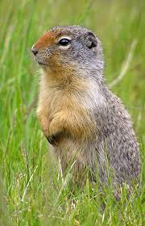

#Parallax-images

##What it does
Parallax images is a **jQuery plugin** that allows you to implement traditional images
in a webpage while calling a single function  to convert the images into a virtually cropped parallaxing
presentation of images that slide vertically within themselves when the page scrolls.

In addition to the *parallaxing scroll* presentation, the plugin adds a mouse-over event
causing the image to *expand to present it entirely*, while the mouse-out event causes
the image to return to the appropriate amount of parallax based on the page scroll.

##How it works

###Requirements

* Your HTML document needs a DocType declaration in order to measure the width and height of elements
  * ````<!doctype html>````
* You need to include the Parallax images css file
  * ````<link rel="stylesheet" href="styles/parallax-images.css">```` 
* You need to include *jQuery* at the bottom of your HTML page, before the closing ````</body>```` tag
  * ````<script type="text/javascript" src="http://code.jquery.com/jquery-latest.min.js"></script>```` 
* You need to include the *parallax-images* plugin at the bottom of your HTML page, before the closing ````</body>```` tag
  * ````<script type="text/javascript" src="scripts/parallax-images.js"></script>```` 

###Markup

* Parallax images transforms traditional HTML```````` tags in your HTML document:
  * ````````
    * Be sure to include:
      * The *parallax-image* class
      * The *width* and *height* of the image
      * An *alt* property value for section-508 compliance
    * Note: *Parallax images does not style your image. If you want to round the corners or inset the image, create additional classes. Parallax images will respect the ````left, middle, right```` alignment of your ```````` tag when it is transformed.
* Include a ````<script>```` block to initiate parallaxification of your ```````` tags
```JavaScript
    <script type="text/javascript">
      $(document).ready(function(){
        $.parallaxify(100);
      });
    </script>
```
  * The ````$.parallaxify(100)```` syntax looks for all ```````` tags with the *parallax-image* class and transforms them into ````<div>```` tags with background images. It converts the *alt* property into a *title* property on the ````<div>```` tag. In the above example it sets the *height* of the ````<div>```` tag equal to the *height* of the image, minus the value passed into the *parallaxify* method. Once the ````<div>```` tag is fully visible in the browser window viewport (it has been scrolled into view) as it scrolls from the bottom of the viewport to the top of the viewport, the *background-image* changes it's css *top* position to scroll the entire image vertically within the ````<div>```` tag creating the parallax effect. Parallaxifying those images also binds the mouse-over and mouse-out events to expand and contract the parallax view and reveal the entire background image all at once.
  * You can update the value passed into the *parallaxify* method to set the pages **crop** value. For example, if your images are very tall (500 pixels) you might want to visually crop the image by 300 pixels for a drammatic parallaxing effect (again, the visitor can always hover the image to see the full version.) Remember that this setting affects all images on the page.

##Additional options

It is very common today for articles to contain featured images or for homepages to contain hero images (large images at the top of the article page, above the scroll.) 

Parallax images takes care of this by providing an additional class *parallax-hero* which sets the start of the parallax image scrolling equal to the top of the document. This means the hero image always aligns to the top of the image, and parallaxes down toward the bottom as the image scrolls away. 

* ````````

##Future goals

Here are a few goals I have for future versions:

* More cross-browser testing
* The ability to set an independent parallaxing crop value for different images on a single page, in addition to a default parallaxing crop value.
* Refactoring to improve performance in a gallery of images.
